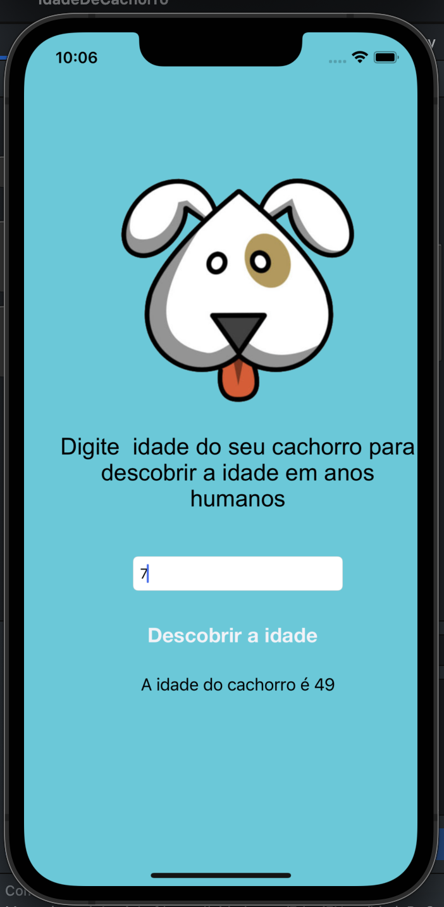

# IdadeDeCachorro

App create for discovery age the dog.

<p>

</p>

## Commands

- Object Library: command+shift+L


## Create References Button

Press control and move to script, when show model:
  - Connection: Action
  - Name: Name function
  - type: Any
  - Event: Touch Up inside
  - Arguments: Sender

```swift
  @IBAction func showAgeDog(_ sender: Any) {
        print("Age Dog")
    }
```

## Create References Label

Press control and move to script, when show model:
  - Connection: outlet
  - Name: Name reference
  - type: UILabel

```swift
  @IBOutlet weak var labelAgeDog: UILabel!
```

## Create References TextField

Press control and move to script, when show model:
  - Connection: outlet
  - Name: Name reference
  - type: UITextField

```swift
  @IBOutlet weak var textFieldAgeDog: UITextField!
```

## Function create age dog

```swift
  import UIKit

  class ViewController: UIViewController {

      @IBOutlet weak var textFieldAgeDog: UITextField!
      @IBOutlet weak var labelAgeDog: UILabel!

      @IBAction func showAgeDog(_ sender: Any) {
          let ageDog = Int(textFieldAgeDog.text!)! * 7
          labelAgeDog.text = "A idade do cachorro é " + String(ageDog)
      }

      override func viewDidLoad() {
          super.viewDidLoad()
      }
  }
```
